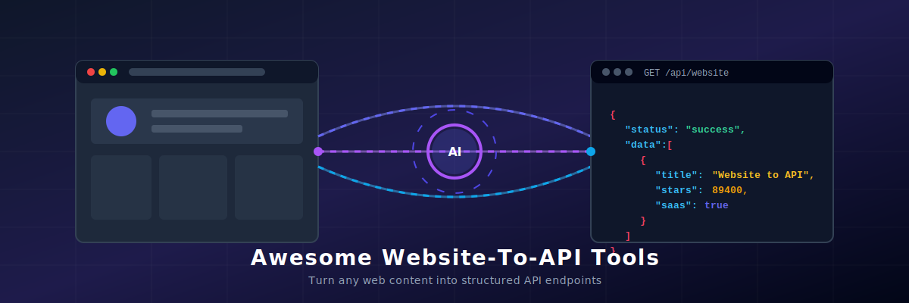

# Awesome-Website-To-API

  
    
  

## 🚀 Top Website-To-API Tools Ecosystem

**Curated List of SaaS Products & Open-Source GitHub Projects** 🌐  
*Focused on Converting Websites into Structured APIs, Scraping & Data Extraction* 📝  
**Last updated: March 2026** 📅

---

### 🔍 What are Website-to-API Tools?
**Website-to-API tools** (also known as web scraping APIs, HTML to JSON converters, or visual web scrapers) automatically extract unstructured data from raw HTML/websites and deliver it as structured, machine-readable format (like **JSON**, **XML**, or **LLM-ready Markdown**). This helps developers, data engineers, and AI model builders integrate live web content directly into their applications without setting up complex custom headless browser scripts, dealing with rotating proxies, or facing anti-bot blocking (Cloudflare/CAPTCHA).

### ✨ Key Benefits of Website-To-API Conversion
- **Zero Crawler Maintenance:** Automatically handles web design changes and layout breakage.
- **Anti-Bot Bypass:** Embedded proxy rotation, stealth browser sessions, and CAPTCHA solving.
- **LLM-Ready Outputs:** Converts arbitrary sites into clean Markdown suited for RAG (Retrieval-Augmented Generation) pipelines.
- **Structured Data Extraction:** Standardizes raw HTML into typed JSON objects dynamically.

---

This repository tracks notable **SaaS platforms** and **open-source projects** for **Website-To-API Tools**. These tools transform any website into a structured, queryable API, enabling web scraping, data extraction, content conversion, and integration into applications without maintaining custom crawlers.

**Examples** include Parse, Integuru, expand.ai, Rindler, and Context.dev (the category leaders). Tools listed here emphasize **ease of use**, structured output (JSON, Markdown, etc.), anti-blocking, JavaScript rendering, and scalability.

**Open-source emphasis**: This section is heavily expanded with every major active project for self-hosting, local execution, full customization, and complete data control — ideal for developers and teams who want privacy, unlimited usage, and no vendor lock-in.

Contributions welcome! Open a PR to add/update entries. Keep descriptions factual and link to official sites.

## 📋 Table of Contents
- [SaaS Products 💼](#saas-products)
- [Open-Source GitHub Projects 📂](#open-source-github-projects)
- [How to Contribute 🤝](#how-to-contribute)
- [Disclaimer ⚠️](#disclaimer)

## 💼 SaaS Products

### ⚙️ Core Platforms (Website-To-API Tools)

| Product | Description | Company Size (Valuation/Revenue) | Pricing & Free Tier Limits |
| :--- | :--- | :--- | :--- |
| **[Parse](https://parseplatform.org/)** (via commercial services like [Back4app](https://www.back4app.com/)) | Backend-as-a-Service with strong web data integration and API generation capabilities. | Estimated $1.7M ARR / ~$3.1M Funding | **Free Tier:** 25,000 requests/month, 250 MB database storage, 1 GB transfer, 1 GB file storage. Paid plans starting at $15/month. |
| **[Context.dev](https://context.dev/)** | Developer-focused tool for turning websites into context-rich, queryable APIs. | YC W25 Backed / ~$10M Valuation | **Free Tier:** 500 API credits (work email) or 250 API credits (free email), plus 10,000 logo link requests. Paid plans available. |
| **[Integuru](https://integuru.com/)** | AI-powered tool that turns any website into a clean, structured API. | YC Backed / ~$10M Valuation | **Free Tier:** Free tier for testing (managed) and free self-hosted open-source version. Managed developer plan starting at ~$30/month. |
| **[Rindler](https://rindler.ai/)** | AI-driven website-to-API conversion with advanced scraping and structuring features. | YC S26 Backed / ~$10M Valuation | **Free Tier:** Free for developers/individuals (full catalog access, map new sites, MCP server). Custom Enterprise pricing for production teams. |
| **[expand.ai](https://expand.ai/)** | Intelligent platform for converting web content into usable APIs and data feeds. | Early Stage / Undisclosed | **Free Tier:** Waitlist / Private Beta. Pricing details unavailable. |

### ⚡ Advanced & Specialized Platforms

**Other notable mentions**: Firecrawl, Browserless, and various AI web scraping services.

## 📂 Open-Source GitHub Projects

### 🛠️ Dedicated Website-To-API Tools

- **[Puppeteer](https://github.com/puppeteer/puppeteer)**   
  Headless Chrome Node.js library for creating custom website scraping and API generation tools.

- **[Playwright](https://github.com/microsoft/playwright)**   
  Modern browser automation library widely used to build reliable website-to-API tools with JavaScript rendering support.

- **[Firecrawl](https://github.com/mendableai/firecrawl)**   
  Powerful open-source tool that crawls and converts any website into clean, structured Markdown or JSON data with LLM-ready output.

- **[Scrapy](https://github.com/scrapy/scrapy)**   
  Powerful Python framework for building web crawlers and turning websites into structured APIs.

- **[Colly](https://github.com/gocolly/colly)**   
  Fast and elegant Go framework for building web scrapers and website-to-API services.

- **[Apify](https://github.com/apify)**   
  Open-source actors and SDK for building scalable web scraping and website-to-API solutions with a large actor store.

- **[Newspaper3k](https://github.com/codelucas/newspaper)**   
  Open-source Python library for extracting and parsing news articles into structured data/APIs.

- **[Browserless](https://github.com/browserless/browserless)**   
  Open-source headless browser service for reliable scraping and website-to-API conversion.

- **[Jina Reader](https://github.com/jina-ai/reader)**   
  Open-source tool that converts any URL into clean, LLM-friendly Markdown or structured data.

- **[ trafilatura](https://github.com/adbar/trafilatura)**   
  Excellent open-source library for extracting main content from web pages into clean, structured formats.

### 🔌 Additional Strong Open-Source Options

- **[Unstructured](https://github.com/Unstructured-IO/unstructured)**  — Library for ingesting and structuring documents and web content.
- **[BeautifulSoup + FastAPI** templates for quick website-to-REST-API wrappers.
- **[LangGraph Web Agents** for intelligent, multi-step website data extraction.
- **[n8n** workflows for building no-code website-to-API pipelines.
- **[Huginn** agents for automated web monitoring and API generation.
- Many community **website-to-JSON** and **web scraper** repositories.

**Frameworks for building custom tools**: Combine **Firecrawl**, **Playwright**, **Scrapy**, and **Jina Reader** with **FastAPI** or **LangGraph** to create robust, self-hosted website-to-API solutions.

## 🤝 How to Contribute

1. Fork the repo. 🍴
2. Add/edit entries in `README.md` (follow existing format). ✍️
3. Include: name, link, 1–2 sentence description, and whether it's SaaS or open-source. 🔗
4. Submit PR with a short explanation. 🚀

Star the repo if you find it useful! ⭐

## ⚠️ Disclaimer

- This is a **community-curated** list — not exhaustive and not an endorsement. 🔍
- Web scraping must comply with website terms of service, robots.txt, and applicable laws (GDPR, CCPA). ⚖️
- Self-hosted open-source solutions require proper proxy management and ethical usage practices. 🛡️

---

**Made for developers, data engineers, AI builders, and automation enthusiasts.**  
Let's make turning websites into APIs more accessible, private, and powerful.
